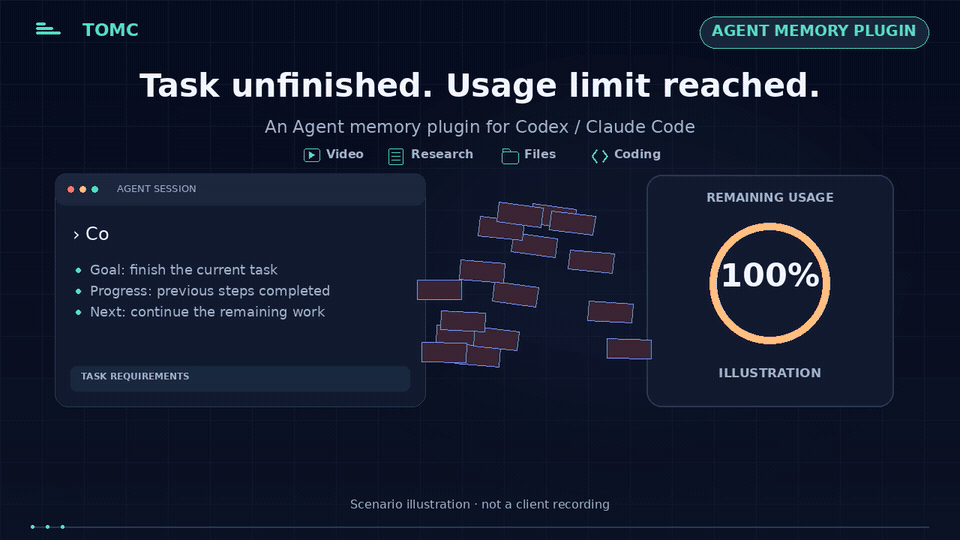
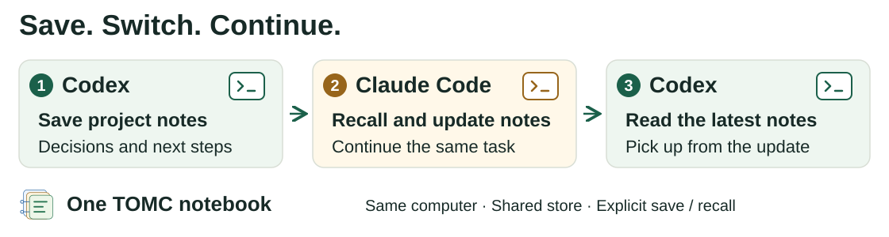
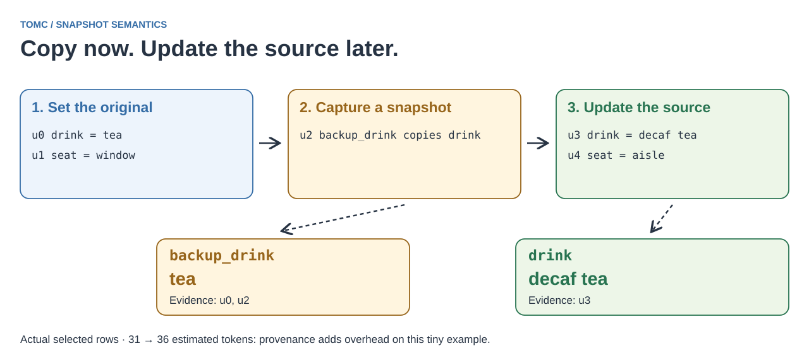
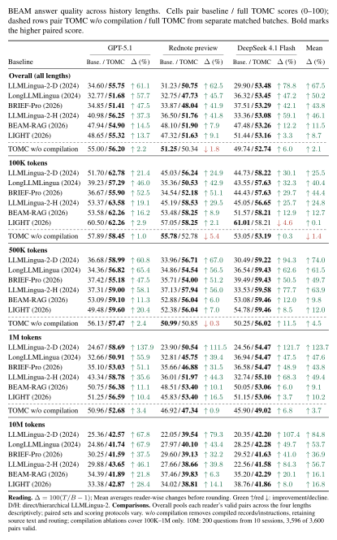
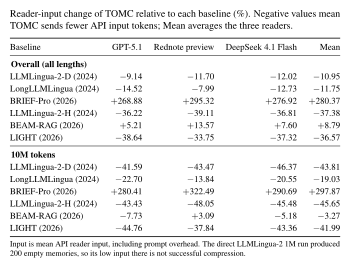

<div align="center">
  
  <h1>Compile context for AI assistants. Save task progress.</h1>
  <h3>An Agent memory plugin for Codex / Claude Code.</h3>
  <p><strong>Compress and compile long histories, and recall saved task notes on CPU.</strong></p>
  <p><a href="#use-before-your-api-call"><strong>Use with your API</strong></a> · <a href="#install-in-your-assistant">Install TOMC</a> · <a href="#switch-assistants">Switch assistants</a> · <a href="#try-the-demo">See the demo</a> · <a href="#paper-explained">Paper explained</a> · <a href="#same-reader-baseline-memory-vs-tomc-memory">Paper results</a> · <a href="README_zh.md">中文</a></p>
  <p><strong>CPU preparation</strong> · No training or extra model service · Plain-text output · Research preview</p>
</div>

<a id="use-tomc"></a>

## Part 1 · Use TOMC

TOMC compresses and compiles context for AI assistants and provides task memory through explicitly saved notes. It is available through an MCP server and a Python API. Give it a history, the next task and a memory budget. It selects source text and computes supported state, relation or count records, so your application can send the prepared context in place of the full history. Preparation runs on CPU, with no training or extra model service.

Use task memory while making videos, organizing materials, handling files or developing code: save the brief, decisions, constraints, completed steps and remaining work with `remember_memory`, then use `recall_memory` to prepare those notes for the next task. These are examples of how to use saved notes. The recorded measurements below cover synthetic project histories and the paper benchmarks, with their own tasks and protocols; they do not establish performance for every task in these workflows.

Add the Python API to your own application, or use the plugin in Codex, Cursor, Claude Desktop or Claude Code. Savings depend on the history and task; short histories can stay intact. The default keeps about 80% of a long history. Compare 40% or 60% budgets on your own tasks when you need smaller requests; see the separate [Codex and Claude results](#measured-savings).

Reuse saved task notes in a new chat with the same assistant or another assistant. With both clients using the same TOMC database on one computer, you can reuse saved decisions, constraints and next steps. [Try the Codex → Claude Code → Codex handoff](#switch-assistants).

<a href="assets/plugin_usage_api_20261003.png">
  
</a>

This is a preview, version **0.1.0**. Download the plugins from the [assistant preview release](https://github.com/ZipengWu365/TOMC/releases/tag/v0.1.0-assistant-preview.5). There is no PyPI package or public marketplace listing.

### 30-second demo

[](launch/media/v11/videos/TOMC_Agent_Complete_EN.mp4)

[Landscape video](launch/media/v11/videos/TOMC_Agent_Complete_EN.mp4) · [Portrait video](launch/media/v11/videos_vertical/TOMC_Agent_Complete_EN_9x16.mp4) · [中文视频](launch/media/v11/videos/TOMC_Agent_Complete_ZH.mp4) · [Media and test scope](launch/media/v11/README.md)

The ending labels **models tested with TOMC** and explains their use: API models receive prepared context; Codex and Claude Code call TOMC tools. The list includes DeepSeek 4.1 Flash, DeepSeek 4 PRO, Rednote Red preview, Claude 5.5 Opus and ChatGPT Codex 6.1 Sol. The five-model list combines recorded tests and the author's reported tests; the demo's token and cost measurements retain their separate protocols. It does not imply a uniform five-model benchmark or provider endorsement.

TOMC is a research preview. Feedback, issues, pull requests and research collaboration are welcome. Device choice and assistant choice are independent; cross-device notebook transfer uses manual Git.

### Install in your assistant

Choose the setup for your client. TOMC prepares context locally on CPU; your assistant generates the answer. The plugin itself needs no additional model API key or GPU.

| Client | Start here | Prerequisites |
|---|---|---|
| Codex CLI | [Download the plugin ZIP](https://github.com/ZipengWu365/TOMC/releases/download/v0.1.0-assistant-preview.5/tomc-memory-codex-0.1.0.zip) | Current Codex CLI with plugin commands, plus [`uv`](https://docs.astral.sh/uv/getting-started/installation/) on PATH or supplied with `--uv` |
| Codex IDE extension | [Configure the local MCP server](docs/assistant_setup.md) | Local TOMC environment with `.[mcp]` installed |
| Cursor | Generate an installation link with the commands below | Local TOMC environment with `.[mcp]` installed |
| Claude Desktop | [Download the `.mcpb` extension](https://github.com/ZipengWu365/TOMC/releases/download/v0.1.0-assistant-preview.5/tomc-memory-0.1.0.mcpb) | Updated Claude Desktop with UV extension support; network access for the first install |
| Claude Code | [Register the `.mcpb` runtime](docs/assistant_plugin.md#claude-code) with `claude mcp add` | [`uv`](https://docs.astral.sh/uv/getting-started/installation/); tested with the Claude Code VS Code extension |

<details>
<summary>Codex installation steps</summary>

#### Codex CLI

Download the ZIP above, extract it to a directory you will keep, and open a terminal in that directory. Run:

```bash
uv run --no-project --python 3.12 install.py --check
uv run --no-project --python 3.12 install.py
```

The first command checks prerequisites without registering the plugin or writing its configuration. The second prepares paths for your computer, registers the local marketplace and installs TOMC. Start a new Codex session to use it. UV downloads Python and dependencies if needed. If an executable is outside PATH, pass `--uv /absolute/path/to/uv` or `--codex /absolute/path/to/codex`; launch the command with your UV executable's path when UV itself is outside PATH. Keep the extracted directory in place; rerun the installer after moving it. Share the original ZIP with others, rather than a configured copy containing your paths.

For the **Codex IDE extension**, use `python -m tomc setup --client codex` from an installed `.[mcp]` environment and add the printed MCP entry to your settings. The [setup guide](docs/assistant_setup.md) includes the direct registration command. Use either a native plugin or standalone TOMC MCP registration in a client to avoid duplicate tools.

</details>

<details>
<summary>Cursor installation steps</summary>

#### Cursor

Clone the repository and activate a local environment using the [assistant setup guide](docs/assistant_setup.md). In that environment, run:

```bash
python -m pip install -e '.[mcp]'
python -m tomc setup --client cursor --link
```

Open the printed link and confirm **Add to Cursor**. Start a new chat and check that TOMC is enabled. The link registers your installed environment; keep that environment in place and regenerate the link if you move it. Links generated on one computer are not installers for another computer.

</details>

<details>
<summary>Claude Desktop installation steps</summary>

#### Claude Desktop

1. Download the `.mcpb` file above.
2. Open **Settings → Extensions → Advanced settings → Install Extension…** and select the file.
3. Follow the installation prompts, then start a new chat and check that TOMC's five tools are available.

A supported host installs Python and the locked dependencies through the UV runtime; you do not need to clone the repository or set up Python manually for this package.

</details>

<details>
<summary>Claude Code installation steps</summary>

#### Claude Code

Claude Code runs the same locked runtime as a local MCP server. Extract the `.mcpb` file above (a ZIP archive) to a directory you will keep, then run these commands with your actual extracted path:

```bash
uv sync --locked --directory "/absolute/path/to/extracted"
claude mcp add tomc-memory --scope user -- uv run --locked --directory "/absolute/path/to/extracted" src/server.py
```

Start a new Claude Code session and run `/mcp` to check the five tools. Name the tool in your request, for example *"Use tomc-memory prepare_context on this history with task … and budget 200"*. If `claude` is not on PATH, use the CLI bundled in the VS Code extension's `resources/native-binary` folder (`claude.exe` on Windows). [Steps, VS Code notes and usage tips](docs/assistant_plugin.md#claude-code)

In the VS Code extension trial with Claude Opus 5.5, with budget 8,192, recalling a notebook answered five questions correctly and cost 38% and 65% less than pasting 20K- and 40K-token histories into the prompt; at about 10K tokens the cost was unchanged. A 1,024 budget was cheaper but missed some latest values. Import long histories outside the chat.

</details>

**Tested on Windows, macOS and Linux, and in Claude Code.** Installation and tool checks passed on all three systems; real model calls passed in Codex on [Windows with preview.4](docs/validation.md#windows-codex-preview4) and macOS and in Claude Code with Claude Opus 5.5. GUI installation in Claude Desktop, Cursor and the Codex app is still unverified. [Platform checks and dates](docs/platform_checks.md)

[Usage tips (English)](docs/usage_tips.md) · [中文使用技巧](docs/usage_tips_zh.md) · [Windows installation feedback](docs/windows_installation_feedback.md) · [Full installation guide](docs/assistant_plugin.md) · [Validation record](docs/validation.md) · [Claude checksum](https://github.com/ZipengWu365/TOMC/releases/download/v0.1.0-assistant-preview.5/tomc-memory-0.1.0.mcpb.sha256) · [Codex checksum](https://github.com/ZipengWu365/TOMC/releases/download/v0.1.0-assistant-preview.5/tomc-memory-codex-0.1.0.zip.sha256).

<a id="switch-assistants"></a>

### Switch assistants, keep your project notes

Save a project brief in Codex, continue from it in Claude Code, then bring the updated notes back. Install TOMC in both clients and make both servers open the same SQLite file. Each save and recall is an explicit tool call. [Shared-path setup](docs/usage_tips.md#reuse-notebooks).

<picture>
  <source media="(max-width: 700px)" srcset="assets/shared_notebook_handoff_mobile.svg">
  
</picture>

<details>
<summary>Try the handoff with three prompts</summary>

This example saves a planning note, not a claim that tests have run.

| Where | Ask your assistant |
|---|---|
| Codex | Use TOMC's `remember_memory` to save this as `api-refactor`: keep public API routes and response fields unchanged. Pagination tests have not been written or run. |
| New Claude Code chat | Use TOMC's `recall_memory` for `api-refactor`, with task: plan the pagination tests, and budget: 1024. Then use `remember_memory` to append: test plan — cover empty results, the last page and invalid page parameters. Tests remain unrun. Show both tool results. |
| New Codex chat | Use TOMC's `recall_memory` for `api-refactor`, with task: summarize the API constraints, latest test plan and unfinished work, and budget: 1024. Show the returned memory before answering. |

</details>

The notebook keeps the original notes and appended updates; recall prepares that history for the next task. This shares saved notes, rather than migrating native chat histories or providing cross-device cloud sync. [MCP interoperability and user-guided checks](docs/validation.md#cross-assistant-notebooks).

### Use before your API call

Install the core package from this checkout with `python -m pip install -e .`. Prepare the history, inspect `prepared.prompt`, then send `prepared.messages` with your existing chat-completions client:

```python
from tomc import prepare_context

prepared = prepare_context(history, task)
response = client.chat.completions.create(
    model=model,
    messages=prepared.messages,
)
```

Here `history`, `task`, `client` and `model` are your application's existing inputs and client. **Replace the original history for this request; appending the prepared context to it adds input.** Keep any instructions your application needs. For other text APIs, map the messages to your provider's format. TOMC changes the request text without changing model weights. [API guide and token counting](docs/api_reference.md).

#### Measured savings

##### Windows Codex · gpt-6.1-sol

**45/45 answers at each budget.** On nine synthetic team-chat histories (three seeds at about 10K, 20K and 40K history tokens), Windows Codex 0.160.0 answered five latest-project-state questions per history. Its original model, `ultra` effort and installed plugins were retained. TOMC prepared context through the installed MCP tool before each new answering chat.

| Context sent | Mean request input tokens | Mean paired input reduction | Correct answers |
|---|---:|---:|---:|
| Full history | 42,191 | Reference | 45/45 |
| TOMC · 40% history budget | 28,713 | 29.7% | 45/45 |
| TOMC · 60% history budget | 33,344 | 19.5% | 45/45 |
| TOMC · default 80% history budget | 38,035 | 9.2% | 45/45 |

Input is Codex's reported total, including cached input, host instructions and tool definitions. Reduction is the mean of nine paired history-level ratios, not the ratio of the table's means. These figures cover one answering turn per history and condition; asking the model to prepare or recall within a chat adds turns. All prepared contexts used `tomc_raw` source selection, without compiled operation records. This tests synthetic latest-state retrieval, rather than general coding quality. [English report](docs/codex_retention_20261005.md) · [中文报告](docs/codex_retention_20261005_zh.md) · [Recorded data](docs/validation_data/windows_codex_retention_20261005.json) · [Budget tips](docs/usage_tips.md#choose-budget). Full-history requests used the same profile with TOMC installed and all existing plugins enabled. The table covers a single answering turn per condition in the test harness; a full agent workflow may involve additional turns.

##### Claude Code · Claude Opus 5.5

**Same answers, smaller requests.** On synthetic team-chat histories of about 10K, 20K and 40K tokens, with dozens to hundreds of state updates and look-alike distractors, Claude Opus 5.5 answered five questions about the latest project state. When TOMC kept 40% of the history, every answer matched the full history and the request cost fell by more than half:

| History | Full history | TOMC keeps 40% | TOMC keeps 60% |
|---|---|---|---|
| ~10K tokens | US$0.169 · 5/5 | US$0.075 · 5/5 (−56%) | US$0.103 · 5/5 (−39%) |
| ~20K tokens | US$0.334 · 5/5 | US$0.141 · 5/5 (−58%) | US$0.195 · 5/5 (−42%) |
| ~40K tokens | US$0.628 · 5/5 | US$0.255 · 5/5 (−59%) | US$0.369 · 5/5 (−41%) |

**Claude Code default-budget check.** Without `budget`, TOMC keeps about 80% of a history's estimated tokens (at least 1,024, so short histories stay intact). Across three different histories at each length, Claude Opus 5.5 answered all 45 questions correctly with about 20% less input; keeping 50%, 60% and 70% also answered all 45 and saved about 49%, 39% and 30%. Smaller budgets started returning outdated values: keeping 10–20% answered three or four of the five questions. Pass a smaller `budget` only after checking it against the full history on a sample of your own tasks. These are synthetic histories with one model and a separate request workflow from the Codex test. [Validation record](docs/validation.md#claude-code-windows-validation) · [Budget tips](docs/usage_tips.md)

The assistant plugin exposes context-preparation tools. It does not intercept every API request or clear messages already in an active chat. To use a smaller request, your application must send the prepared context, or you can hand it to a new chat. Notebook storage is optional.

### Prepare context

After installing, ask your assistant to call TOMC's `prepare_context` tool. Pass the text below as `history`, set `task` to `"What are the current framework and backup_framework values?"` and `budget` to `64`, then ask the assistant to answer using the returned memory.

```text
framework = Flask
backup_framework copies framework
framework = FastAPI
Monday notes: the team reviewed the project backlog, discussed deployment windows and agreed to keep the public API routes and response fields unchanged during the refactor.
Tuesday notes: the migration plan still needs a review from the database owner, and the pagination tests have not yet been written or run.
Wednesday notes: the team checked the release checklist, added a rollback task, and postponed the documentation update until after the test results are available.
```

This example uses explicit assignments and a snapshot copy. TOMC prepares `framework = FastAPI` and `backup_framework = Flask`, with source links. The host controls tool use; your existing model generates the answer.

With the same instructions and task, this example's message text goes from **147 to 108 tokens** under `cl100k_base`. This counts message content, excluding provider chat framing and tools; it is a single example, not billed usage or a fixed saving rate. Run `python examples/api_context.py` for the offline lexical estimate, or see the [API guide](docs/api_reference.md) for BPE counting.

`prepare_context` does not save this history. Histories that already fit stay intact; longer prose can use retrieval instead of typed records. The `budget` covers memory under the lexical counter; task text and tool framing add overhead.

<details>
<summary>Optional: keep history across chats</summary>

The notebook stores supplied text in its original form. `recall_memory` prepares that history for the requested task; direct `prepare_context` calls need no notebook and write nothing to it.

#### Try memory across two chats or assistants

In the first chat, for example in Codex:

> Use TOMC to remember this as api-refactor: keep the public API routes and response fields unchanged. Pagination tests still need to be written.

In a new chat, for example in Claude Code using the same database:

> Recall api-refactor from TOMC. Before we continue, remind me of the constraints and unfinished work.

The default database is `~/.tomc/memory.sqlite3`. Both servers must resolve to the same file; a custom `--store` or `TOMC_MEMORY_PATH` can keep a client separate. [Check the paths and try the handoff](docs/usage_tips.md#reuse-notebooks). TOMC sees the notes passed to its tools; installing it does not automatically capture every chat. The assistant decides which tools to call under its permission settings.

</details>

### Try the demo

The demo shows how TOMC prepares context for a task. It does not create notebooks across chats.

#### Hosted preview

Open the [private Hugging Face demo](https://huggingface.co/spaces/Zipeng365/tomc-agent-memory-demo), enter a history and the next task, and prepare the context. Copy the resulting prompt into your usual model. No reader API key is needed for preparation. Access to this Space is separate from GitHub access; if it is unavailable to you, run the demo locally below. The hosted preview may precede this release; the local checkout contains the current English interface.

#### Run locally

The Gradio interface requires Python 3.10–3.13. Clone the repository:

```bash
git clone https://github.com/ZipengWu365/TOMC.git
cd TOMC
```

On macOS, check `python3 --version` first: a system Python 3.9 cannot run TOMC. With [UV installed](https://docs.astral.sh/uv/getting-started/installation/), you can let it provide Python 3.12 and start the demo directly:

```bash
uv run --python 3.12 --extra demo python -m demo.app
```

Alternatively, use an existing compatible Python with the environment steps below. [macOS guide](docs/macos_usage.md).

On Linux/macOS, use [UV](https://docs.astral.sh/uv/getting-started/installation/) to manage Python and avoid missing system `venv`/`ensurepip` modules. These commands passed the Linux check:

```bash
uv venv --python 3.12 --seed .venv
source .venv/bin/activate
```

If you prefer system Python, use `python3 -m venv .venv` and activate it as above. Debian/Ubuntu installations need the matching `python3-venv` package. If a failed command already created a partial environment, recover with `uv venv --python 3.12 --allow-existing --seed .venv`.

Or in Windows PowerShell with Python 3.12 installed:

```powershell
py -3.12 -m venv .venv
.venv\Scripts\Activate.ps1
```

Then install and start the demo:

```bash
python -m pip install -e '.[demo]'
python -m demo.app
```

1. Open **http://127.0.0.1:7860** and select **Use now**.
2. Click **Try demo** to prepare an example, or paste your history, enter the next task and click **Prepare**.
3. Copy the prepared prompt using the copy icon and paste it into your usual model.

Text, Markdown, message JSON and JSONL are supported. Local preparation works offline after installation. Your model generates the answer when you use the prepared prompt; the default demo makes no reader API call. The hosted preview processes input on the Space server.

Use **30-second tour** for a guided example, **Workbench** to compare strategies, or **Research evidence** to explore the archived paper results. [Desktop view](assets/demo_desktop.png) · [Mobile view](assets/demo_mobile.png).

Fresh downloads passed [Linux installation and browser checks](docs/linux_validation.md) on Ubuntu 24.04.5 with Python 3.12.13. The report includes screenshots, plugin checks and installation feedback.

#### Practical tips

- Start with **Try demo** and its **Small request** example. For ordinary prose, try **Balanced** or **More detail** and inspect the retained sources before lowering the budget.
- Send the prepared messages **instead of** the original history in your next API request. For manual use, paste the prompt into a **new chat**; adding it to a long existing chat keeps that chat's earlier input.
- Keep task questions specific. Inspect state records and source text, especially after changing the history or memory size. The token display is an estimate of message content, not provider billing.
- For plugins, keep the installation directory and Python environment in place. Use one TOMC registration per client; share the original package, not configuration containing your local paths. The [Linux report](docs/linux_validation.md#using-the-plugins) explains verification and recovery.

<a id="paper-explained"></a>

## Part 2 · The paper explained

The paper is *Task-Oriented Memory Compilation: Executable State Representations for Long-Context Language Models*. An arXiv link will be added soon. This section explains its method and archived results.

In the paper, GPT-5.1, Rednote preview and DeepSeek V4.1 Flash are API reader models. Each paired baseline and TOMC comparison keeps the same reader. Codex and Claude Code are assistant hosts for the plugin trials, using `gpt-6.1-sol` and Claude Opus 5.5 respectively; those trials are separate from the paper benchmark. [Reader models and assistant hosts](docs/readers_and_agents.md)

### What TOMC computes

Long conversations contain changed facts, earlier copies, and evidence scattered across messages. TOMC prepares memory for the current question before you call the LLM. It computes state, relation, or count records and combines them with selected source text under a token budget.

<p><strong>CPU construction</strong> · No training or auxiliary neural model · Plain-text output · Research preview</p>

<a href="assets/paper_method.png">
  
</a>

*Method overview from the manuscript. The demo uses a small reference parser; the [method documentation](docs/method.md) explains how it differs from the benchmark implementations.*

Suppose a history contains these updates:

```text
drink = tea
backup_drink copies drink
drink = decaf tea
```

The current value is `drink = decaf tea`, while `backup_drink = tea` keeps the value at the time of the copy. TOMC executes these operations in order and links the resulting records to their source lines.

<details>
<summary>Run this example in Python</summary>

```python
from tomc import compile_memory

result = compile_memory(
    messages="drink = tea\nbackup_drink copies drink\ndrink = decaf tea",
    query="What are the current drink and backup_drink values?",
    token_budget=128,
    strategy="tomc",
)
print(result.compiled_memory)
print(result.ledger)  # records and their sources
```

</details>

<picture>
  <source media="(max-width: 700px)" srcset="assets/snapshot_semantics_mobile.svg">
  
</picture>

*Run `python examples/snapshot.py` for the full example, which also tracks `seat`. This example demonstrates copy semantics. Its source labels add tokens; it does not measure answer quality.*

Relations and counts follow the same idea: compute the operation needed for the question before handing memory to the reader. Keep source wording for questions about reasons, quotations, or other details that a state record cannot express.

### Same reader, baseline memory vs TOMC memory

The BEAM study uses **GPT-5.1, Rednote preview, and DeepSeek 4.1 Flash** to answer questions over 100K, 500K, 1M and 10M-token histories. Each reader answers with either TOMC memory or one of six baseline memory configurations.

- **Quality:** TOMC has higher mean scores in all **54 reader × baseline × length comparisons at 500K, 1M and 10M**, and all 18 overall comparisons.
- **Reader input:** across 100K–10M, overall input is **36.57% lower than LIGHT** and **37.38% lower than hierarchical LLMLingua-2**, averaging reader-wise changes equally. Some other baselines use less input than TOMC.
- **CPU construction:** the measured TOMC stage averages **4.21 s/call** across six replays, with **0 GiB CUDA allocation** and **3.75 GiB peak process RSS**. Per-call construction was 11.4× shorter than BRIEF-Pro and 17.1× shorter than LongLLMLingua in the recorded stages. These are stage-time ratios, with reader inference excluded.

In each pair, the same reader answers matched questions using memory built by the named baseline or by TOMC, with matched scoring within the pair.

<!-- BEAM_TABLE_START -->
<a href="assets/beam_table/beam_quality.png">
  
</a>

<a href="assets/beam_table/beam_input.png">
  
</a>

<details>
<summary>Tables as text</summary>

| Baseline | GPT-5.1 | Δ (%) | Rednote preview | Δ (%) | DeepSeek 4.1 Flash | Δ (%) | Mean Δ (%) |
|---|---:|:---|---:|:---|---:|:---|:---|
| **Overall (all lengths)** | | | | | | | |
| LLMLingua-2-D (2024) | 34.60 / **55.75** | ↑ 61.1 | 31.23 / **50.75** | ↑ 62.5 | 29.90 / **53.48** | ↑ 78.8 | ↑ 67.5 |
| LongLLMLingua (2024) | 32.77 / **51.68** | ↑ 57.7 | 32.75 / **47.73** | ↑ 45.7 | 36.32 / **53.45** | ↑ 47.2 | ↑ 50.2 |
| BRIEF-Pro (2026) | 34.85 / **51.41** | ↑ 47.5 | 33.87 / **48.04** | ↑ 41.9 | 37.51 / **53.29** | ↑ 42.1 | ↑ 43.8 |
| LLMLingua-2-H (2024) | 40.98 / **56.25** | ↑ 37.3 | 36.50 / **51.76** | ↑ 41.8 | 33.36 / **53.08** | ↑ 59.1 | ↑ 46.1 |
| BEAM-RAG (2026) | 47.94 / **54.90** | ↑ 14.5 | 48.10 / **51.90** | ↑ 7.9 | 47.48 / **53.26** | ↑ 12.2 | ↑ 11.5 |
| LIGHT (2026) | 48.65 / **55.32** | ↑ 13.7 | 47.32 / **51.63** | ↑ 9.1 | 51.44 / **53.16** | ↑ 3.3 | ↑ 8.7 |
| TOMC w/o compilation | 55.00 / **56.20** | ↑ 2.2 | **51.25** / 50.34 | ↓ 1.8 | 49.74 / **52.74** | ↑ 6.0 | ↑ 2.1 |
| **100K tokens** | | | | | | | |
| LLMLingua-2-D (2024) | 51.70 / **62.78** | ↑ 21.4 | 45.03 / **56.24** | ↑ 24.9 | 44.73 / **58.22** | ↑ 30.1 | ↑ 25.5 |
| LongLLMLingua (2024) | 39.23 / **57.29** | ↑ 46.0 | 35.36 / **50.53** | ↑ 42.9 | 43.55 / **57.63** | ↑ 32.3 | ↑ 40.4 |
| BRIEF-Pro (2026) | 36.67 / **55.90** | ↑ 52.5 | 34.54 / **52.18** | ↑ 51.1 | 44.43 / **57.63** | ↑ 29.7 | ↑ 44.4 |
| LLMLingua-2-H (2024) | 53.37 / **63.58** | ↑ 19.1 | 45.19 / **58.53** | ↑ 29.5 | 45.05 / **56.65** | ↑ 25.7 | ↑ 24.8 |
| BEAM-RAG (2026) | 53.58 / **62.26** | ↑ 16.2 | 53.48 / **58.25** | ↑ 8.9 | 51.57 / **58.21** | ↑ 12.9 | ↑ 12.7 |
| LIGHT (2026) | 60.50 / **62.26** | ↑ 2.9 | 57.05 / **58.25** | ↑ 2.1 | **61.01** / 58.21 | ↓ 4.6 | ↑ 0.1 |
| TOMC w/o compilation | 57.89 / **58.45** | ↑ 1.0 | **55.78** / 52.78 | ↓ 5.4 | 53.05 / **53.19** | ↑ 0.3 | ↓ 1.4 |
| **500K tokens** | | | | | | | |
| LLMLingua-2-D (2024) | 36.68 / **58.99** | ↑ 60.8 | 33.96 / **56.71** | ↑ 67.0 | 30.49 / **59.22** | ↑ 94.3 | ↑ 74.0 |
| LongLLMLingua (2024) | 34.36 / **56.82** | ↑ 65.4 | 34.86 / **54.54** | ↑ 56.5 | 36.54 / **59.43** | ↑ 62.6 | ↑ 61.5 |
| BRIEF-Pro (2026) | 37.42 / **55.18** | ↑ 47.5 | 35.71 / **54.00** | ↑ 51.2 | 39.49 / **59.43** | ↑ 50.5 | ↑ 49.7 |
| LLMLingua-2-H (2024) | 37.31 / **59.00** | ↑ 58.1 | 37.13 / **57.94** | ↑ 56.0 | 33.53 / **59.58** | ↑ 77.7 | ↑ 63.9 |
| BEAM-RAG (2026) | 53.09 / **59.10** | ↑ 11.3 | 52.88 / **56.04** | ↑ 6.0 | 53.08 / **59.46** | ↑ 12.0 | ↑ 9.8 |
| LIGHT (2026) | 49.48 / **59.60** | ↑ 20.4 | 52.38 / **56.04** | ↑ 7.0 | 54.78 / **59.46** | ↑ 8.5 | ↑ 12.0 |
| TOMC w/o compilation | 56.13 / **57.47** | ↑ 2.4 | **50.99** / 50.85 | ↓ 0.3 | 50.25 / **56.02** | ↑ 11.5 | ↑ 4.5 |
| **1M tokens** | | | | | | | |
| LLMLingua-2-D (2024) | 24.67 / **58.69** | ↑ 137.9 | 23.90 / **50.54** | ↑ 111.5 | 24.56 / **54.47** | ↑ 121.7 | ↑ 123.7 |
| LongLLMLingua (2024) | 32.66 / **50.91** | ↑ 55.9 | 32.81 / **45.75** | ↑ 39.4 | 36.94 / **54.47** | ↑ 47.5 | ↑ 47.6 |
| BRIEF-Pro (2026) | 35.10 / **53.03** | ↑ 51.1 | 35.66 / **46.88** | ↑ 31.5 | 36.58 / **54.47** | ↑ 48.9 | ↑ 43.8 |
| LLMLingua-2-H (2024) | 43.34 / **58.78** | ↑ 35.6 | 36.01 / **51.97** | ↑ 44.3 | 32.74 / **55.10** | ↑ 68.3 | ↑ 49.4 |
| BEAM-RAG (2026) | 50.75 / **56.38** | ↑ 11.1 | 48.51 / **53.40** | ↑ 10.1 | 50.05 / **53.06** | ↑ 6.0 | ↑ 9.1 |
| LIGHT (2026) | 51.25 / **56.59** | ↑ 10.4 | 45.83 / **53.40** | ↑ 16.5 | 51.15 / **53.06** | ↑ 3.7 | ↑ 10.2 |
| TOMC w/o compilation | 50.96 / **52.68** | ↑ 3.4 | 46.92 / **47.34** | ↑ 0.9 | 45.90 / **49.02** | ↑ 6.8 | ↑ 3.7 |
| **10M tokens** | | | | | | | |
| LLMLingua-2-D (2024) | 25.36 / **42.57** | ↑ 67.8 | 22.05 / **39.54** | ↑ 79.3 | 20.35 / **42.20** | ↑ 107.4 | ↑ 84.8 |
| LongLLMLingua (2024) | 24.86 / **41.74** | ↑ 67.9 | 27.97 / **40.10** | ↑ 43.4 | 28.25 / **42.28** | ↑ 49.7 | ↑ 53.7 |
| BRIEF-Pro (2026) | 30.25 / **41.59** | ↑ 37.5 | 29.60 / **39.13** | ↑ 32.2 | 29.52 / **41.63** | ↑ 41.0 | ↑ 36.9 |
| LLMLingua-2-H (2024) | 29.88 / **43.65** | ↑ 46.1 | 27.66 / **38.66** | ↑ 39.8 | 22.56 / **41.58** | ↑ 84.3 | ↑ 56.7 |
| BEAM-RAG (2026) | 34.39 / **41.89** | ↑ 21.8 | 37.46 / **39.83** | ↑ 6.3 | 35.20 / **42.29** | ↑ 20.1 | ↑ 16.1 |
| LIGHT (2026) | 33.38 / **42.87** | ↑ 28.4 | 34.02 / **38.81** | ↑ 14.1 | 38.76 / **41.86** | ↑ 8.0 | ↑ 16.8 |

| Baseline | Overall input change | 10M input change |
|---|---:|---:|
| LLMLingua-2-D (2024) | -10.95% | -43.81% |
| LongLLMLingua (2024) | -11.75% | -19.03% |
| BRIEF-Pro (2026) | +280.37% | +297.87% |
| LLMLingua-2-H (2024) | -37.38% | -45.65% |
| BEAM-RAG (2026) | +8.79% | -3.27% |
| LIGHT (2026) | -36.57% | -41.99% |

</details>
<!-- BEAM_TABLE_END -->

*D/H denote direct/hierarchical LLMLingua-2. Overall pools each reader's valid pairs across all lengths; paired sets and scoring protocols vary across rows, so compare within each cell. Higher mean scores do not establish significance. Input change is TOMC relative to the baseline: negative means fewer tokens. The direct LLMLingua-2 1M run produced 200 empty memories; its scores are retained, and that input reduction is not treated as successful compression.*

*10M was added on 2026-10-10: 200 BEAM questions from 10 sessions, 3,596 of 3,600 pairs valid, scored with an anonymous position-balanced pairwise rubric. Both LLMLingua-2 10M rows use a repaired batch with non-empty memories. The w/o compilation rows cover 100K–1M; the 10M ablation is still running. [10M data and scoring](benchmarks/beam_10m_20261010/README.md).*

<a href="assets/paper_beam.png">
  
</a>

*The top comparison pools valid 500K/1M questions within each reader, then averages relative changes across readers. Ability panels use common valid questions and equal length means. [All lengths, pair counts, and protocols](benchmarks/RESULTS.md).*

**What do the compiled records add?** A separate BEAM ablation removes the records and accompanying instructions, retaining source text and upstream routing. Temporal reasoning scores are higher with compilation for all three readers, while its overall effect varies by reader. This is a comparison with and without compilation, separate from the baseline table above.

RULER-derived diagnostics examine state tracking and the source text needed for NIAH and QA2. The repaired NIAH source-removal pair scores **87.28 / 82.26 mean F1**, with about **43%–44%** less input after removal. It uses a separate paired rerun; its scores are not combined with historical Query results. [Task results and limits](docs/claims_and_limitations.md).

<a href="assets/paper_ruler.png">
  
</a>

*Figure 3 from the manuscript. Panels a,b use Query selection as the input reference; c,d use full TOMC/state route, with the repaired NIAH pair marked †. VT is a state-route diagnostic. [Larger 2×2 review layout](assets/paper_ruler_review.png) · [Numerical results](docs/paper_results.md#ruler-derived-mechanisms-and-component-ablations).*

The paper's [construction-cost Table 3](docs/paper_results.md#construction-efficiency-and-resources) retains the measured stage times and CPU/GPU/RAM scope; reader inference is excluded. [Figure sources](docs/PAPER_FIGURE_USAGE.json).

The evidence snapshot was synced from manuscript commit **`7399657`** on **2026-09-28**. Benchmark adapters produced these scores. The demo uses a smaller parser and line-level BM25; its `rag` is different from BEAM-RAG, and its `hybrid` router is different from the [historical Hybrid-RAG control](benchmarks/HISTORICAL_BEAM.md).

### Choose a strategy

| Strategy | Memory sent to the reader | Useful for |
|---|---|---|
| `raw` | Complete input, even if it exceeds the budget | An uncompressed reference |
| `head` / `tail` | Text from the beginning or end | Position-based controls |
| `rag` | BM25-ranked source lines | Lexical lookup |
| `tomc` | Records-only mechanism; retrieval when no records are found | Inspecting supported state, relation, or count operations |
| `tomc_raw` (compiler default) | Records plus selected source text | Tasks that need computed records and original wording |
| `hybrid` | A representation chosen by fixed task rules | Mixed tasks and quotation requests |

#### String matching and input limits

The reference parser recognizes forms such as `key = value`, `B copies A`, and `x -[rel]-> y`. Evidence selection and routing also use fixed lexical rules. Paraphrases, ambiguous names, implicit updates, and unfamiliar formats can lead to missed evidence or an unsuitable route.

For structured state, use the documented syntax and inspect the source links. For ordinary prose, use retrieval or a route that retains source text. These options preserve useful evidence but do not guarantee that every relevant detail fits the budget. [Supported operations](docs/method.md) · [Known limitations](docs/claims_and_limitations.md).

#### Token counts

The demo reports a **lexical estimate** by default. Its memory count excludes the task, chat framing, reader output, and inspector. Optional `tiktoken:cl100k_base` counts that encoding; provider billing may differ. `retention_ratio` means output/input, and `compression_ratio` means input/output. Any displayed prices come from user-supplied rates. The default demo makes no reader API call.

### Use from Python

For a Python application, call `prepare_context(history, task)` before your existing reader call.

**Your reader model stays the same.** TOMC returns text you can use with any text-based LLM API, or copy into a chat interface. The built-in connector supports chat-completions-compatible APIs; other providers use your own client and message format. No model weights or API key are needed to construct memory. Answer generation uses your chosen model as usual.

```text
History + current task → TOMC on CPU → prepared context → your existing LLM API
```

The core package requires Python 3.10+ and has no runtime dependencies. From an activated environment in the checkout, install `python -m pip install -e .`:

```python
from tomc import prepare_context

context = prepare_context(
    "The workshop now has 28 attendees. Room B is available but not booked.",
    "What should we do next?",
)
print(context.prompt)  # paste into a chat interface
# Or pass context.messages to your existing chat-completions client.
# For other APIs, use context.prompt or map the messages to their input format.
```

### Check the results and extend the demo

```bash
python -m pip install -e '.[demo,dev,mcp]'
python -m pytest -q
python benchmarks/reproduce/current.py
python benchmarks/reproduce/results.py
python -m mkdocs build --strict
```

The current-results script verifies snapshot hashes and aggregate arithmetic. The historical-results script reconstructs the older four-reader statistics from conversation aggregates. [Reproducibility](docs/reproducibility.md) describes what is available for each batch.

To run your own reader, pass `result.reader_messages(query)` to your client or use the optional [API connector](docs/api_reference.md). The [LLMLingua adapter](docs/comparison_with_llmlingua.md) is installed separately. [CONTRIBUTING.md](CONTRIBUTING.md) covers checks and how to report an input the compiler handles incorrectly.

### Citation and license

TOMC's source code is available under the [PolyForm Noncommercial License 1.0.0](LICENSE): it is free for research, teaching, personal and other non-commercial use. Commercial use requires a separate license; contact Zipeng Wu (zxw365@student.bham.ac.uk). Use [CITATION.cff](CITATION.cff) to cite the software. The paper is titled *Task-Oriented Memory Compilation: Executable State Representations for Long-Context Language Models*; a public paper link will be added when available.

Examples are synthetic. The repository distributes numeric benchmark aggregates without question text, reader answers, or private API payloads. [Data provenance](DATA_PROVENANCE.md) · [Data and licensing](docs/data_and_license.md).

<details>
<summary>For maintainers</summary>

Maintainer drafts: [launch copy](launch/CONTENT_KIT.md) · [launch plan](launch/PLAN_ZH.md) · [release checklist](launch/RELEASE_CHECKLIST.md).

[Hugging Face deployment settings](docs/huggingface_space.md).

</details>

