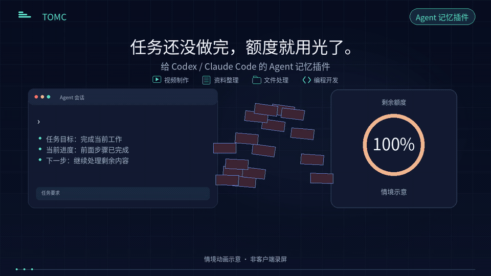
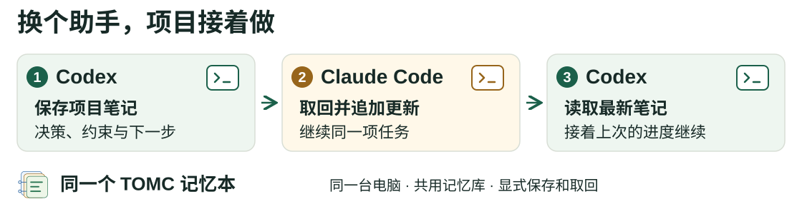
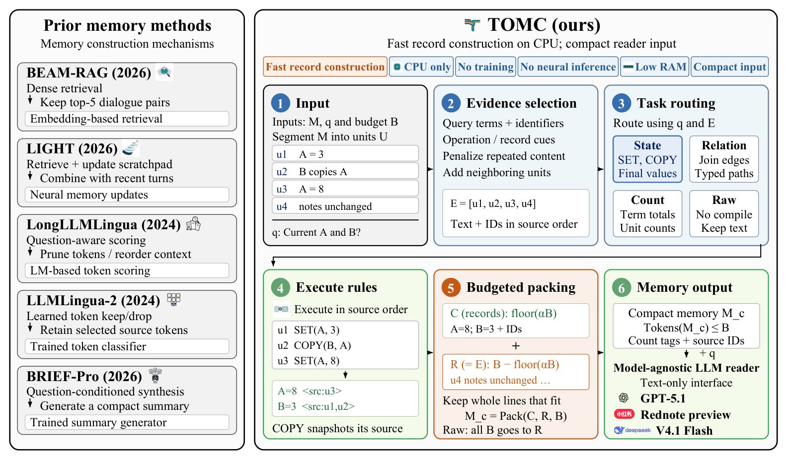
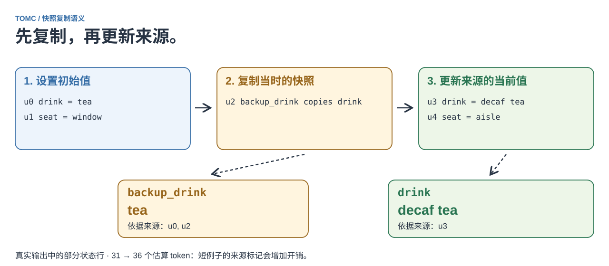
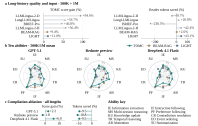
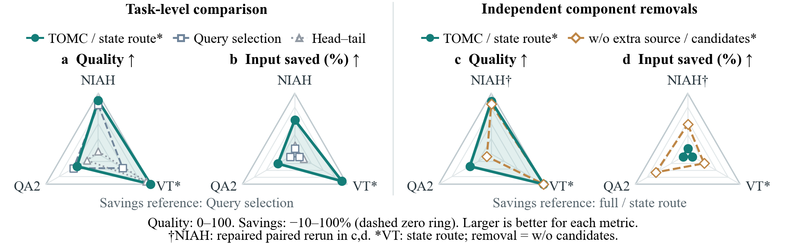

<div align="center">
  
  <h1>为 AI 助手压缩编译上下文，保存任务进度</h1>
  <h3>面向 Codex / Claude Code 的 Agent 记忆插件</h3>
  <p><strong>在 CPU 上压缩编译长历史，取回已保存的任务笔记。</strong></p>
  <p><a href="#接在你的-api-调用之前"><strong>接入 API</strong></a> · <a href="#接入常用助手">安装 TOMC</a> · <a href="#switch-assistants">换助手继续</a> · <a href="#试用演示">查看 Demo</a> · <a href="#paper-explained">论文详解</a> · <a href="#同一个模型基线记忆与-tomc-记忆">论文结果</a> · <a href="README.md">English</a></p>
  <p><strong>CPU 准备上下文</strong> · 无需训练或额外模型服务 · 输出普通文本 · 研究预览</p>
</div>

<a id="use-tomc"></a>

## 第一部分：使用 TOMC

TOMC 为 AI 助手压缩编译上下文，并通过明确保存的笔记提供任务记忆。它提供 MCP 服务和 Python API。给它一段历史、下一步任务和记忆预算。它选择原文，对支持的状态、关系或计数操作计算记录，让你的应用用准备后的上下文替换完整历史。准备过程在 CPU 上运行，无需训练或额外模型服务。

让助手制作视频、整理资料、处理文件或进行编程开发时，可以用 `remember_memory` 保存任务要求、决策、约束、已完成步骤和待办事项，再用 `recall_memory` 为下一步任务准备这些笔记。这里列的是任务记忆的使用场景。下面的实测数据来自合成项目历史和论文基准，各有明确的任务与协议，不能直接推广为上述所有任务的效果。

可以把 Python API 接进自己的应用，也可以在 Codex、Cursor、Claude Desktop 或 Claude Code 中安装插件。节省量取决于历史和任务；短历史可以保持完整。默认保留长历史的约 80%。需要更小的请求时，可以用自己的任务比较 40% 或 60% 预算；参见分别记录的 [Codex 与 Claude 实测](#实测节省)。

新开聊天后，可以在原来的助手或另一个助手中复用已保存的任务笔记。两个客户端使用同一台电脑上的同一 TOMC 数据库时，可以复用已保存的决策、约束和下一步任务。[试一次 Codex → Claude Code → Codex 接续](#switch-assistants)。

<a href="assets/plugin_usage_api_20261003.png">
  
</a>

当前是 **v0.1.0 预览版**。插件可从[助手插件预览版](https://github.com/ZipengWu365/TOMC/releases/tag/v0.1.0-assistant-preview.5)下载。尚无 PyPI 发布版或公开插件市场条目。

### 30 秒演示

[](launch/media/v11/videos/TOMC_Agent_Complete_ZH.mp4)

[横版视频](launch/media/v11/videos/TOMC_Agent_Complete_ZH.mp4) · [竖版视频](launch/media/v11/videos_vertical/TOMC_Agent_Complete_ZH_9x16.mp4) · [English video](launch/media/v11/videos/TOMC_Agent_Complete_EN.mp4) · [素材与测试范围](launch/media/v11/README.md)

结尾明确标注**已使用 TOMC 测试的模型**及用途：API 模型接收准备好的上下文，Codex 和 Claude Code 调用 TOMC 工具。名单包含 DeepSeek 4.1 Flash、DeepSeek 4 PRO、小红书 Red preview、Claude 5.5 Opus、ChatGPT Codex 6.1 Sol。这份名单综合已有测试记录与作者提供的测试情况；视频中的 token 和费用结果各有独立协议，不能解释为五模型统一基准或提供商背书。

TOMC 目前是研究预览。欢迎试用、反馈、提交 Issue 和 PR，以及交流与研究合作。换设备与换助手可以独立选择；跨设备笔记传递采用手动 Git。

### 接入常用助手

选择你所用客户端的接入方式。TOMC 在本地 CPU 上准备上下文，回答由助手生成；插件本身不需要额外的大模型 API key 或 GPU。

| 客户端 | 从哪里开始 | 前提条件 |
|---|---|---|
| Codex CLI | [下载插件 ZIP](https://github.com/ZipengWu365/TOMC/releases/download/v0.1.0-assistant-preview.5/tomc-memory-codex-0.1.0.zip) | 支持插件命令的新版 Codex CLI，且 [`uv`](https://docs.astral.sh/uv/getting-started/installation/) 在 PATH 中或通过 `--uv` 指定 |
| Codex IDE extension | [配置本地 MCP 服务](docs/assistant_setup.md) | 本地 TOMC 环境已安装 `.[mcp]` |
| Cursor | 用下面的命令生成安装链接 | 本地 TOMC 环境已安装 `.[mcp]` |
| Claude Desktop | [下载 `.mcpb` 扩展](https://github.com/ZipengWu365/TOMC/releases/download/v0.1.0-assistant-preview.5/tomc-memory-0.1.0.mcpb) | 支持 UV 扩展的新版 Claude Desktop；首次安装需要联网 |
| Claude Code | 用 `claude mcp add` [注册 `.mcpb` 中的运行环境](docs/assistant_plugin_zh.md#claude-code) | [`uv`](https://docs.astral.sh/uv/getting-started/installation/)；已在 Claude Code 的 VS Code 扩展中测试 |

<details>
<summary>Codex 安装步骤</summary>

#### Codex CLI

下载上面的 ZIP，解压到准备长期保留的目录，在该目录打开终端并执行：

```bash
uv run --no-project --python 3.12 install.py --check
uv run --no-project --python 3.12 install.py
```

第一条命令检查前提条件，不注册插件或写入插件配置；第二条为这台电脑生成路径、注册本地插件市场并安装 TOMC。之后新开 Codex 会话即可使用。UV 会按需下载 Python 和依赖。可执行文件不在 PATH 中时，用 `--uv /absolute/path/to/uv` 或 `--codex /absolute/path/to/codex` 指定；UV 本身不在 PATH 时，启动命令也应使用它的路径。请保留解压目录，移动后重新运行安装助手。给其他人分享时使用原始 ZIP，不要分享已包含自己电脑路径的配置副本。

**Codex IDE extension** 用户应在已安装 `.[mcp]` 的环境中执行 `python -m tomc setup --client codex`，将打印出的 MCP 条目加入设置。[接入指南](docs/assistant_setup.md)也提供直接注册命令。同一客户端选择原生插件或独立 TOMC MCP 注册中的一种，避免工具重复。

</details>

<details>
<summary>Cursor 安装步骤</summary>

#### Cursor

按[助手接入指南](docs/assistant_setup.md)克隆仓库并激活本地环境，然后在该环境中执行：

```bash
python -m pip install -e '.[mcp]'
python -m tomc setup --client cursor --link
```

打开打印出的链接，确认 **Add to Cursor**。新开聊天，检查 TOMC 是否已启用。链接负责注册已有环境；请保留该环境，移动后重新生成链接。在一台电脑上生成的路径链接，不能当作另一台电脑的安装包。

</details>

<details>
<summary>Claude Desktop 安装步骤</summary>

#### Claude Desktop

1. 下载上面的 `.mcpb` 文件。
2. 打开 **Settings → Extensions → Advanced settings → Install Extension…**，选择文件。
3. 按提示确认安装，再新开聊天，检查 TOMC 的五个工具是否可用。

支持该运行方式的客户端会通过 UV 管理 Python 和锁定依赖；使用这个包不需要克隆仓库或手动配置 Python。

</details>

<details>
<summary>Claude Code 安装步骤</summary>

#### Claude Code

Claude Code 以本地 MCP 服务的方式运行同一套锁定环境。把上面的 `.mcpb` 文件（ZIP 格式）解压到一个会长期保留的目录，然后把以下示例路径替换为实际解压路径并运行：

```bash
uv sync --locked --directory "/absolute/path/to/extracted"
claude mcp add tomc-memory --scope user -- uv run --locked --directory "/absolute/path/to/extracted" src/server.py
```

新开一个 Claude Code 会话，输入 `/mcp`，检查五个工具是否可用。请求里要点名工具，例如 *"用 tomc-memory 的 prepare_context 处理这段历史，task 是……，budget 设为 200"*。如果 `claude` 不在 PATH 中，可以使用 VS Code 扩展 `resources/native-binary` 目录里自带的 CLI（Windows 上是 `claude.exe`）。[完整步骤、VS Code 注意事项与使用技巧](docs/assistant_plugin_zh.md#claude-code)

VS Code 扩展实测中（模型为 Claude Opus 5.5），预算设为 8,192 时，从笔记本取回作答 5 题全对；对 20K 和 40K token 的历史，费用比直接贴进提示词分别低 38% 和 65%，约 10K token 时费用持平。预算 1,024 更便宜，但会漏掉部分最新值。长历史请在聊天之外导入。

</details>

**已在 Windows、macOS、Linux 和 Claude Code 中实测。** 三个系统都通过了安装和工具检查；Codex（[Windows preview.4](docs/validation.md#windows-codex-preview4)、macOS）和 Claude Code（Claude Opus 5.5）通过了真实模型调用。Claude Desktop、Cursor 和 Codex 桌面应用的图形界面安装仍待验证。[各平台检查记录](docs/platform_checks_zh.md)

[Usage tips (English)](docs/usage_tips.md) · [中文使用技巧](docs/usage_tips_zh.md) · [Windows 安装反馈](docs/windows_installation_feedback_zh.md) · [完整中文安装指南](docs/assistant_plugin_zh.md) · [验证记录](docs/validation.md) · [Claude 校验文件](https://github.com/ZipengWu365/TOMC/releases/download/v0.1.0-assistant-preview.5/tomc-memory-0.1.0.mcpb.sha256) · [Codex 校验文件](https://github.com/ZipengWu365/TOMC/releases/download/v0.1.0-assistant-preview.5/tomc-memory-codex-0.1.0.zip.sha256)。

<a id="switch-assistants"></a>

### 换助手，保留项目笔记

在 Codex 保存项目背景，到 Claude Code 接着做，再把更新后的笔记带回 Codex。两边都安装 TOMC，并让服务打开同一个 SQLite 文件。保存和取回都需要明确调用工具。[共享路径设置](docs/usage_tips_zh.md#reuse-notebooks)。

<picture>
  <source media="(max-width: 700px)" srcset="assets/shared_notebook_handoff_zh_mobile.svg">
  
</picture>

<details>
<summary>用三段提示词试一次接续</summary>

这个例子保存测试计划，不宣称测试已经运行。

| 在哪里 | 告诉助手 |
|---|---|
| Codex | 请用 TOMC 的 `remember_memory` 保存到 `api-refactor`：公共 API 路由与返回字段保持不变。分页测试尚未编写，也没有运行。 |
| 新的 Claude Code 聊天 | 请用 TOMC 的 `recall_memory` 读取 `api-refactor`，task 为：规划分页测试，budget 为 1024。然后用 `remember_memory` 追加：测试计划覆盖空结果、最后一页和无效分页参数。测试仍未运行。展示两次工具返回的结果。 |
| 新的 Codex 聊天 | 请用 TOMC 的 `recall_memory` 读取 `api-refactor`，task 为：总结 API 约束、最新测试计划和未完成工作，budget 为 1024。先展示返回的 memory，再依据它回答。 |

</details>

记忆本保留原始笔记和追加更新，取回时为下一步任务准备上下文。共享的是明确保存的笔记，不会迁移原生聊天记录，也不提供跨设备云同步。[MCP 互操作和用户引导检查](docs/validation.md#cross-assistant-notebooks)。

### 接在你的 API 调用之前

在仓库环境中用 `python -m pip install -e .` 安装核心包。先准备历史，检查 `prepared.prompt`，再把 `prepared.messages` 交给已有的 chat-completions 客户端：

```python
from tomc import prepare_context

prepared = prepare_context(history, task)
response = client.chat.completions.create(
    model=model,
    messages=prepared.messages,
)
```

这里的 `history`、`task`、`client` 和 `model` 来自你已有的应用。**本次请求用准备后的消息替换原历史；追加到原历史后面会增加输入。** 保留应用所需的指令。其他文本 API 可转换为各自的消息格式；TOMC 改变请求文本，无需修改模型权重。[API 用法与 token 计数](docs/api_reference.md)。

#### 实测节省

##### Windows Codex · gpt-6.1-sol

**每种预算均为 45/45。** 测试使用九份合成团队聊天历史：三个 seed，分别生成约 10K、20K、40K history token 的历史，每份回答五个项目最新状态问题。Windows Codex 0.160.0 保留原有模型、`ultra` effort 和已安装插件。TOMC 先通过已安装的 MCP 工具准备上下文，再交给各自的新聊天回答。

| 发送的上下文 | 平均请求输入 token | 平均配对输入减少 | 正确回答 |
|---|---:|---:|---:|
| 完整历史 | 42,191 | 参照 | 45/45 |
| TOMC · 40% 历史预算 | 28,713 | 29.7% | 45/45 |
| TOMC · 60% 历史预算 | 33,344 | 19.5% | 45/45 |
| TOMC · 默认 80% 历史预算 | 38,035 | 9.2% | 45/45 |

输入采用 Codex 返回的总量，包含缓存输入、宿主指令和工具定义。减少比例是九份历史各自配对比例的均值，不是表中两个均值直接相除。每份历史、每种条件只统计一次回答回合；让模型在聊天中准备或取回上下文还会增加回合。所有准备结果都使用 `tomc_raw` 原文选择，没有生成操作记录。本次测试针对合成历史的最新状态查找，不代表通用编程质量。[English report](docs/codex_retention_20261005.md) · [中文报告](docs/codex_retention_20261005_zh.md) · [原始记录](docs/validation_data/windows_codex_retention_20261005.json) · [预算技巧](docs/usage_tips_zh.md#choose-budget)。完整历史对照也使用相同的配置，TOMC 已安装，其他已启用插件保持启用。表中测量的是测试程序内每种条件的单次回答回合；完整 agent 工作流还可能包含额外回合。

##### Claude Code · Claude Opus 5.5

**答案一样，请求更小。** 我们用约 10K、20K、40K token 的合成团队聊天历史测试，里面有几十到几百次状态更新，还混有同样关键词的干扰信息；由 Claude Opus 5.5 回答 5 个关于项目最新状态的问题。TOMC 保留 40% 的历史时，答案与完整历史完全一致，请求费用降低一半以上：

| 历史长度 | 完整历史 | TOMC 保留 40% | TOMC 保留 60% |
|---|---|---|---|
| 约 10K token | US$0.169 · 5/5 | US$0.075 · 5/5（−56%） | US$0.103 · 5/5（−39%） |
| 约 20K token | US$0.334 · 5/5 | US$0.141 · 5/5（−58%） | US$0.195 · 5/5（−42%） |
| 约 40K token | US$0.628 · 5/5 | US$0.255 · 5/5（−59%） | US$0.369 · 5/5（−41%） |

**Claude Code 的默认预算检查。** 不传 `budget` 时，TOMC 保留历史估算长度的约 80%（至少 1,024，短历史保持完整）。在每种长度各 3 份不同的历史上，Claude Opus 5.5 默认设置 45 题全对，输入约减少 20%；保留 50%、60%、70% 也都 45 题全对，分别约省 49%、39%、30%。预算再小就开始返回过时的值：只保留 10–20% 时，5 题只答对 3 到 4 题。只有在拿自己的一部分任务和完整历史对比确认后，才建议传入更小的 `budget`。以上为单一模型在合成历史上的测试，请求工作流与 Codex 测试不同。[验证记录](docs/validation.md#claude-code-windows-validation) · [预算技巧](docs/usage_tips_zh.md)

助手插件提供上下文准备工具，不会自动拦截每次 API 请求，也不会清除当前聊天已有的消息。要发送更少的上下文，需要应用采用准备后的消息，或把结果交给新聊天。记忆本存储是可选功能。

### 准备上下文

安装后，让助手调用 TOMC 的 `prepare_context` 工具：把下面的文本传给 `history`，将 `task` 设为 `"当前 framework 和 backup_framework 的值是什么？"`，`budget` 设为 `64`，再让助手根据返回的记忆回答。

```text
framework = Flask
backup_framework copies framework
framework = FastAPI
Monday notes: the team reviewed the project backlog, discussed deployment windows and agreed to keep the public API routes and response fields unchanged during the refactor.
Tuesday notes: the migration plan still needs a review from the database owner, and the pagination tests have not yet been written or run.
Wednesday notes: the team checked the release checklist, added a rollback task, and postponed the documentation update until after the test results are available.
```

这个例子使用显式赋值和复制。TOMC 准备 `framework = FastAPI`、`backup_framework = Flask` 两条记录，并保留来源链接。是否调用工具由客户端控制，回答由原来的模型生成。

使用相同的指令和任务，这个例子的消息文本按 `cl100k_base` 计数从 **147 降到 108 token**。它不包含供应商的聊天封装和工具信息，是单个例子的文本计数，不是账单用量或固定节省率。运行 `python examples/api_context.py` 可离线查看词法估计，[API 指南](docs/api_reference.md)提供 BPE 计数方法。

`prepare_context` 不保存这段历史。已能放进预算的历史保持完整；较长的普通文本可以使用检索，不一定产生结构化记录。`budget` 按词法计数器限制记忆文本，任务和工具消息框架还会增加输入。

<details>
<summary>可选：跨聊天保存与取回历史</summary>

记忆本保存传入的原始文本，`recall_memory` 在取回时为任务准备上下文。直接调用 `prepare_context` 不需要记忆本，也不写入它。

#### 换个聊天或助手，继续同一项任务

第一段聊天，例如在 Codex 中：

> 请用 TOMC 把这些项目笔记保存到 api-refactor：公开 API 路由与返回字段保持不变，分页测试还没补上。

新开一段聊天，例如在使用同一数据库的 Claude Code 中：

> 从 TOMC 取回 api-refactor。继续开发前，提醒我有哪些约束和待办。

默认数据库是 `~/.tomc/memory.sqlite3`。两边的服务必须打开同一个文件；自定义 `--store` 或 `TOMC_MEMORY_PATH` 可能让某个客户端使用独立记忆本。[核对路径并试一次接续](docs/usage_tips_zh.md#reuse-notebooks)。TOMC 只看到传给工具的笔记；安装插件不会自动捕获全部聊天。助手遵循客户端权限设置，决定何时调用工具。

</details>

### 试用演示

Demo 用于查看 TOMC 如何为任务准备上下文，不创建跨聊天记忆本。

#### 托管预览

打开[私有 Hugging Face Demo](https://huggingface.co/spaces/Zipeng365/tomc-agent-memory-demo)，输入历史和下一步任务，准备上下文，再把 prompt 复制到你常用的模型。准备上下文不需要回答模型的 API key。Space 的权限与 GitHub 权限相互独立；如果打不开，可以按下面的步骤在本地运行。托管预览可能早于本次发布版本，本地最新代码提供当前英文界面。

#### 本地运行

Gradio 界面需要 Python 3.10–3.13。先克隆仓库：

```bash
git clone https://github.com/ZipengWu365/TOMC.git
cd TOMC
```

macOS 先检查 `python3 --version`：系统 Python 3.9 不能运行 TOMC。[安装 UV](https://docs.astral.sh/uv/getting-started/installation/)后，可以让它提供 Python 3.12 并直接启动：

```bash
uv run --python 3.12 --extra demo python -m demo.app
```

也可以用已有的兼容 Python 按下面步骤创建环境。详见 [macOS 指南](docs/macos_usage.md#chinese-quickstart)。

macOS/Linux 推荐用 [`uv`](https://docs.astral.sh/uv/getting-started/installation/) 创建带 pip 的 Python 3.12 环境；首次使用可能需要联网下载 Python：

```bash
uv venv --python 3.12 --seed .venv
source .venv/bin/activate
```

也可以使用系统 Python：`python3 -m venv .venv`，再执行相同的激活命令。Ubuntu/Debian 的系统 Python 需要安装匹配的 venv/ensurepip 组件；默认 Python 可先用 `sudo apt install python3-venv` 安装。如果先前因缺少 `ensurepip` 只生成了部分环境，可用 `uv venv --python 3.12 --allow-existing --seed .venv` 重新创建，再激活它。

或者安装 Python 3.12 后，在 Windows PowerShell 中执行：

```powershell
py -3.12 -m venv .venv
.venv\Scripts\Activate.ps1
```

然后安装并启动 Demo：

```bash
python -m pip install -e '.[demo]'
python -m demo.app
```

1. 打开 **http://127.0.0.1:7860**，选择 **Use now**。
2. 点击 **Try demo** 直接生成示例；或者粘贴自己的历史、输入下一步任务，再点击 **Prepare**。
3. 点击复制图标，把生成的 prompt 粘贴到你常用的模型。

支持文本、Markdown、消息 JSON 和 JSONL。安装后，本地准备上下文无需联网。你把 prompt 交给模型之后才会生成回答，默认 Demo 不调用回答模型；托管预览在 Space 服务器上处理输入。

本轮从最新代码在 **Ubuntu 24.04.5、Python 3.12.13、Gradio 5.49.1** 上完成安装与本地 Demo 检查；系统 Python 3.12.3 缺少 `ensurepip`，上面的 UV 步骤避开了该安装阻碍。[Linux 验证记录](docs/linux_validation.md)。

**使用提示：** 将准备后的上下文用于下一次请求或新聊天，不要追加到同一段完整历史后面。**Memory size → Small request** 适合短记录示例；普通段落可改用 **Balanced** 或 **More detail**，避免整行证据放不进预算。展开 **How this context was prepared**，核对来源和计算出的状态，再把结果交给模型。插件安装时，同一客户端选择原生插件或独立 MCP 注册中的一种；保留安装目录，分享原始安装包。

**30-second tour** 提供引导示例，**Workbench** 提供策略比较，**Research evidence** 展示归档的论文结果。[桌面界面](assets/demo_desktop.png) · [手机界面](assets/demo_mobile.png)。

<a id="paper-explained"></a>

## 第二部分：论文详解

论文题目是 *Task-Oriented Memory Compilation: Executable State Representations for Long-Context Language Models*。上传后会补上 arXiv 链接。这里解释论文方法及归档实验结果。

论文中的 GPT-5.1、Rednote preview 和 DeepSeek V4.1 Flash 是 API 回答模型（reader）；每组基线与 TOMC 配对比较保持同一个 reader。Codex 和 Claude Code 是插件试用的助手宿主，分别使用 `gpt-6.1-sol` 和 Claude Opus 5.5；这些试用与论文基准实验分开。[回答模型与助手宿主](docs/readers_and_agents_zh.md)

### TOMC 计算了什么

长对话里，事实会更新，早先的副本可能仍然有效，回答所需的证据也可能分散在多条消息中。TOMC 在调用大模型之前，根据当前问题计算状态、关系或计数记录，再在 token 预算内结合选中的原文。

<p><strong>CPU 构建</strong> · 无需训练或辅助神经模型 · 输出普通文本 · 研究预览</p>

<a href="assets/paper_method.png">
  
</a>

*方法图来自论文。Demo 使用较小的参考解析器，与实验适配器的差异见[方法说明](docs/method.md)。*

例如，历史中有三条操作：

```text
drink = tea
backup_drink copies drink
drink = decaf tea
```

当前 `drink` 是 `decaf tea`，但 `backup_drink` 保留复制时的 `tea`。TOMC 按顺序执行操作，并把结果连接到原始语句。

<details>
<summary>用 Python 运行这个例子</summary>

```python
from tomc import compile_memory

result = compile_memory(
    messages="drink = tea\nbackup_drink copies drink\ndrink = decaf tea",
    query="当前 drink 和 backup_drink 是什么？",
    token_budget=128,
    strategy="tomc",
)
print(result.compiled_memory)
print(result.ledger)  # 记录及其来源
```

</details>

<picture>
  <source media="(max-width: 700px)" srcset="assets/snapshot_semantics_zh_mobile.svg">
  
</picture>

*运行 `python examples/snapshot.py` 可查看完整案例，其中还包含 `seat`。这个例子解释复制语义，来源标记会增加 token；它没有测量模型回答质量。*

关系和计数也遵循这个思路：先计算当前问题需要的操作，再交给模型。涉及原因、引用或其他无法由状态记录表达的细节时，需要保留原文。

### 同一个模型，基线记忆与 TOMC 记忆

BEAM 实验使用 **GPT-5.1、Rednote preview 和 DeepSeek 4.1 Flash**，回答 100K、500K、1M 和 10M-token 历史上的问题。每个模型分别使用 TOMC 记忆和六种基线配置的记忆。

- **回答质量：** 在 500K、1M 和 10M 的 **54 个模型 × 基线 × 长度组合**中，TOMC 的均值都更高；整体 18 个比较的均值也都更高。
- **模型输入：** 在 100K–10M 范围内，各模型的变化等权平均后，整体输入比 LIGHT 少 **36.57%**，比分层 LLMLingua-2 少 **37.38%**。其他部分基线的输入比 TOMC 更少。
- **CPU 构建：** 六次重放的实测阶段平均 **4.21 秒/次**，CUDA 分配为 **0 GiB**，进程峰值 RSS 为 **3.75 GiB**。记录的每次构建耗时为 BRIEF-Pro 的 1/11.4、LongLLMLingua 的 1/17.1；这些是构建阶段的时间比，不包含回答模型推理。

**每格为 基线 / TOMC 分数（0–100），后接 Δ = 100(TOMC / 基线 − 1)。** 同一个模型分别使用该行基线构建的记忆和 TOMC 构建的记忆，每对使用匹配的问题和评分。“平均”是三个模型相对变化的等权平均，最后才舍入。粗体标出每对中较高的分数。*TOMC w/o compilation* 行把消融版本与完整 TOMC 配对，来自单独的匹配批次。

<!-- BEAM_TABLE_START -->
| 基线 | GPT-5.1<br>基线 / TOMC | Δ (%) | Rednote preview<br>基线 / TOMC | Δ (%) | DeepSeek 4.1 Flash<br>基线 / TOMC | Δ (%) | 平均<br>Δ (%) |
|---|---:|:---|---:|:---|---:|:---|:---|
| **整体（全部长度）** | | | | | | | |
| LLMLingua-2-D (2024) | 34.60 / **55.75** | ${\color{#176B47}\uparrow}$ 61.1 | 31.23 / **50.75** | ${\color{#176B47}\uparrow}$ 62.5 | 29.90 / **53.48** | ${\color{#176B47}\uparrow}$ 78.8 | ${\color{#176B47}\uparrow}$ 67.5 |
| LongLLMLingua (2024) | 32.77 / **51.68** | ${\color{#176B47}\uparrow}$ 57.7 | 32.75 / **47.73** | ${\color{#176B47}\uparrow}$ 45.7 | 36.32 / **53.45** | ${\color{#176B47}\uparrow}$ 47.2 | ${\color{#176B47}\uparrow}$ 50.2 |
| BRIEF-Pro (2026) | 34.85 / **51.41** | ${\color{#176B47}\uparrow}$ 47.5 | 33.87 / **48.04** | ${\color{#176B47}\uparrow}$ 41.9 | 37.51 / **53.29** | ${\color{#176B47}\uparrow}$ 42.1 | ${\color{#176B47}\uparrow}$ 43.8 |
| LLMLingua-2-H (2024) | 40.98 / **56.25** | ${\color{#176B47}\uparrow}$ 37.3 | 36.50 / **51.76** | ${\color{#176B47}\uparrow}$ 41.8 | 33.36 / **53.08** | ${\color{#176B47}\uparrow}$ 59.1 | ${\color{#176B47}\uparrow}$ 46.1 |
| BEAM-RAG (2026) | 47.94 / **54.90** | ${\color{#176B47}\uparrow}$ 14.5 | 48.10 / **51.90** | ${\color{#176B47}\uparrow}$ 7.9 | 47.48 / **53.26** | ${\color{#176B47}\uparrow}$ 12.2 | ${\color{#176B47}\uparrow}$ 11.5 |
| LIGHT (2026) | 48.65 / **55.32** | ${\color{#176B47}\uparrow}$ 13.7 | 47.32 / **51.63** | ${\color{#176B47}\uparrow}$ 9.1 | 51.44 / **53.16** | ${\color{#176B47}\uparrow}$ 3.3 | ${\color{#176B47}\uparrow}$ 8.7 |
| *TOMC w/o compilation（去掉编译记录）* | 55.00 / **56.20** | ${\color{#176B47}\uparrow}$ 2.2 | **51.25** / 50.34 | ${\color{#B43B32}\downarrow}$ 1.8 | 49.74 / **52.74** | ${\color{#176B47}\uparrow}$ 6.0 | ${\color{#176B47}\uparrow}$ 2.1 |
| **10M tokens** | | | | | | | |
| LLMLingua-2-D (2024) | 25.36 / **42.57** | ${\color{#176B47}\uparrow}$ 67.8 | 22.05 / **39.54** | ${\color{#176B47}\uparrow}$ 79.3 | 20.35 / **42.20** | ${\color{#176B47}\uparrow}$ 107.4 | ${\color{#176B47}\uparrow}$ 84.8 |
| LongLLMLingua (2024) | 24.86 / **41.74** | ${\color{#176B47}\uparrow}$ 67.9 | 27.97 / **40.10** | ${\color{#176B47}\uparrow}$ 43.4 | 28.25 / **42.28** | ${\color{#176B47}\uparrow}$ 49.7 | ${\color{#176B47}\uparrow}$ 53.7 |
| BRIEF-Pro (2026) | 30.25 / **41.59** | ${\color{#176B47}\uparrow}$ 37.5 | 29.60 / **39.13** | ${\color{#176B47}\uparrow}$ 32.2 | 29.52 / **41.63** | ${\color{#176B47}\uparrow}$ 41.0 | ${\color{#176B47}\uparrow}$ 36.9 |
| LLMLingua-2-H (2024) | 29.88 / **43.65** | ${\color{#176B47}\uparrow}$ 46.1 | 27.66 / **38.66** | ${\color{#176B47}\uparrow}$ 39.8 | 22.56 / **41.58** | ${\color{#176B47}\uparrow}$ 84.3 | ${\color{#176B47}\uparrow}$ 56.7 |
| BEAM-RAG (2026) | 34.39 / **41.89** | ${\color{#176B47}\uparrow}$ 21.8 | 37.46 / **39.83** | ${\color{#176B47}\uparrow}$ 6.3 | 35.20 / **42.29** | ${\color{#176B47}\uparrow}$ 20.1 | ${\color{#176B47}\uparrow}$ 16.1 |
| LIGHT (2026) | 33.38 / **42.87** | ${\color{#176B47}\uparrow}$ 28.4 | 34.02 / **38.81** | ${\color{#176B47}\uparrow}$ 14.1 | 38.76 / **41.86** | ${\color{#176B47}\uparrow}$ 8.0 | ${\color{#176B47}\uparrow}$ 16.8 |

<details>
<summary>100K、500K 和 1M tokens</summary>

| 基线 | GPT-5.1<br>基线 / TOMC | Δ (%) | Rednote preview<br>基线 / TOMC | Δ (%) | DeepSeek 4.1 Flash<br>基线 / TOMC | Δ (%) | 平均<br>Δ (%) |
|---|---:|:---|---:|:---|---:|:---|:---|
| **100K tokens** | | | | | | | |
| LLMLingua-2-D (2024) | 51.70 / **62.78** | ${\color{#176B47}\uparrow}$ 21.4 | 45.03 / **56.24** | ${\color{#176B47}\uparrow}$ 24.9 | 44.73 / **58.22** | ${\color{#176B47}\uparrow}$ 30.1 | ${\color{#176B47}\uparrow}$ 25.5 |
| LongLLMLingua (2024) | 39.23 / **57.29** | ${\color{#176B47}\uparrow}$ 46.0 | 35.36 / **50.53** | ${\color{#176B47}\uparrow}$ 42.9 | 43.55 / **57.63** | ${\color{#176B47}\uparrow}$ 32.3 | ${\color{#176B47}\uparrow}$ 40.4 |
| BRIEF-Pro (2026) | 36.67 / **55.90** | ${\color{#176B47}\uparrow}$ 52.5 | 34.54 / **52.18** | ${\color{#176B47}\uparrow}$ 51.1 | 44.43 / **57.63** | ${\color{#176B47}\uparrow}$ 29.7 | ${\color{#176B47}\uparrow}$ 44.4 |
| LLMLingua-2-H (2024) | 53.37 / **63.58** | ${\color{#176B47}\uparrow}$ 19.1 | 45.19 / **58.53** | ${\color{#176B47}\uparrow}$ 29.5 | 45.05 / **56.65** | ${\color{#176B47}\uparrow}$ 25.7 | ${\color{#176B47}\uparrow}$ 24.8 |
| BEAM-RAG (2026) | 53.58 / **62.26** | ${\color{#176B47}\uparrow}$ 16.2 | 53.48 / **58.25** | ${\color{#176B47}\uparrow}$ 8.9 | 51.57 / **58.21** | ${\color{#176B47}\uparrow}$ 12.9 | ${\color{#176B47}\uparrow}$ 12.7 |
| LIGHT (2026) | 60.50 / **62.26** | ${\color{#176B47}\uparrow}$ 2.9 | 57.05 / **58.25** | ${\color{#176B47}\uparrow}$ 2.1 | **61.01** / 58.21 | ${\color{#B43B32}\downarrow}$ 4.6 | ${\color{#176B47}\uparrow}$ 0.1 |
| *TOMC w/o compilation（去掉编译记录）* | 57.89 / **58.45** | ${\color{#176B47}\uparrow}$ 1.0 | **55.78** / 52.78 | ${\color{#B43B32}\downarrow}$ 5.4 | 53.05 / **53.19** | ${\color{#176B47}\uparrow}$ 0.3 | ${\color{#B43B32}\downarrow}$ 1.4 |
| **500K tokens** | | | | | | | |
| LLMLingua-2-D (2024) | 36.68 / **58.99** | ${\color{#176B47}\uparrow}$ 60.8 | 33.96 / **56.71** | ${\color{#176B47}\uparrow}$ 67.0 | 30.49 / **59.22** | ${\color{#176B47}\uparrow}$ 94.3 | ${\color{#176B47}\uparrow}$ 74.0 |
| LongLLMLingua (2024) | 34.36 / **56.82** | ${\color{#176B47}\uparrow}$ 65.4 | 34.86 / **54.54** | ${\color{#176B47}\uparrow}$ 56.5 | 36.54 / **59.43** | ${\color{#176B47}\uparrow}$ 62.6 | ${\color{#176B47}\uparrow}$ 61.5 |
| BRIEF-Pro (2026) | 37.42 / **55.18** | ${\color{#176B47}\uparrow}$ 47.5 | 35.71 / **54.00** | ${\color{#176B47}\uparrow}$ 51.2 | 39.49 / **59.43** | ${\color{#176B47}\uparrow}$ 50.5 | ${\color{#176B47}\uparrow}$ 49.7 |
| LLMLingua-2-H (2024) | 37.31 / **59.00** | ${\color{#176B47}\uparrow}$ 58.1 | 37.13 / **57.94** | ${\color{#176B47}\uparrow}$ 56.0 | 33.53 / **59.58** | ${\color{#176B47}\uparrow}$ 77.7 | ${\color{#176B47}\uparrow}$ 63.9 |
| BEAM-RAG (2026) | 53.09 / **59.10** | ${\color{#176B47}\uparrow}$ 11.3 | 52.88 / **56.04** | ${\color{#176B47}\uparrow}$ 6.0 | 53.08 / **59.46** | ${\color{#176B47}\uparrow}$ 12.0 | ${\color{#176B47}\uparrow}$ 9.8 |
| LIGHT (2026) | 49.48 / **59.60** | ${\color{#176B47}\uparrow}$ 20.4 | 52.38 / **56.04** | ${\color{#176B47}\uparrow}$ 7.0 | 54.78 / **59.46** | ${\color{#176B47}\uparrow}$ 8.5 | ${\color{#176B47}\uparrow}$ 12.0 |
| *TOMC w/o compilation（去掉编译记录）* | 56.13 / **57.47** | ${\color{#176B47}\uparrow}$ 2.4 | **50.99** / 50.85 | ${\color{#B43B32}\downarrow}$ 0.3 | 50.25 / **56.02** | ${\color{#176B47}\uparrow}$ 11.5 | ${\color{#176B47}\uparrow}$ 4.5 |
| **1M tokens** | | | | | | | |
| LLMLingua-2-D (2024) | 24.67 / **58.69** | ${\color{#176B47}\uparrow}$ 137.9 | 23.90 / **50.54** | ${\color{#176B47}\uparrow}$ 111.5 | 24.56 / **54.47** | ${\color{#176B47}\uparrow}$ 121.7 | ${\color{#176B47}\uparrow}$ 123.7 |
| LongLLMLingua (2024) | 32.66 / **50.91** | ${\color{#176B47}\uparrow}$ 55.9 | 32.81 / **45.75** | ${\color{#176B47}\uparrow}$ 39.4 | 36.94 / **54.47** | ${\color{#176B47}\uparrow}$ 47.5 | ${\color{#176B47}\uparrow}$ 47.6 |
| BRIEF-Pro (2026) | 35.10 / **53.03** | ${\color{#176B47}\uparrow}$ 51.1 | 35.66 / **46.88** | ${\color{#176B47}\uparrow}$ 31.5 | 36.58 / **54.47** | ${\color{#176B47}\uparrow}$ 48.9 | ${\color{#176B47}\uparrow}$ 43.8 |
| LLMLingua-2-H (2024) | 43.34 / **58.78** | ${\color{#176B47}\uparrow}$ 35.6 | 36.01 / **51.97** | ${\color{#176B47}\uparrow}$ 44.3 | 32.74 / **55.10** | ${\color{#176B47}\uparrow}$ 68.3 | ${\color{#176B47}\uparrow}$ 49.4 |
| BEAM-RAG (2026) | 50.75 / **56.38** | ${\color{#176B47}\uparrow}$ 11.1 | 48.51 / **53.40** | ${\color{#176B47}\uparrow}$ 10.1 | 50.05 / **53.06** | ${\color{#176B47}\uparrow}$ 6.0 | ${\color{#176B47}\uparrow}$ 9.1 |
| LIGHT (2026) | 51.25 / **56.59** | ${\color{#176B47}\uparrow}$ 10.4 | 45.83 / **53.40** | ${\color{#176B47}\uparrow}$ 16.5 | 51.15 / **53.06** | ${\color{#176B47}\uparrow}$ 3.7 | ${\color{#176B47}\uparrow}$ 10.2 |
| *TOMC w/o compilation（去掉编译记录）* | 50.96 / **52.68** | ${\color{#176B47}\uparrow}$ 3.4 | 46.92 / **47.34** | ${\color{#176B47}\uparrow}$ 0.9 | 45.90 / **49.02** | ${\color{#176B47}\uparrow}$ 6.8 | ${\color{#176B47}\uparrow}$ 3.7 |

</details>

| 基线 | 整体输入变化 | 10M 输入变化 |
|---|---:|---:|
| LLMLingua-2-D (2024) | -10.95% | -43.81% |
| LongLLMLingua (2024) | -11.75% | -19.03% |
| BRIEF-Pro (2026) | +280.37% | +297.87% |
| LLMLingua-2-H (2024) | -37.38% | -45.65% |
| BEAM-RAG (2026) | +8.79% | -3.27% |
| LIGHT (2026) | -36.57% | -41.99% |
<!-- BEAM_TABLE_END -->

*D/H 表示直接/分层 LLMLingua-2。“整体”在每个模型内合并全部长度的有效配对；各行的配对集合与评分协议不同，应在同一单元格内比较。均值更高不等于统计显著。输入变化以基线为分母，负值表示 TOMC 输入更少。直接 LLMLingua-2 的 1M 实验出现 200 个空记忆；保留其分数，但不把这部分低输入解释成成功压缩。*

*10M 于 2026-10-10 加入：来自 10 个会话的 200 道 BEAM 题，3,600 个配对中 3,596 个有效，使用匿名、位置平衡的成对评分标准。两种 LLMLingua-2 的 10M 结果来自修复后的批次，记忆均非空。w/o compilation 行覆盖 100K–1M；10M 消融仍在运行。[10M 数据与评分](benchmarks/beam_10m_20261010/README.md)。*

<a href="assets/paper_beam.png">
  
</a>

*顶部比较先在各模型内合并 500K/1M 的有效问题，再等权平均相对变化。能力图使用共同有效问题，两档长度的均值等权平均。[全部长度、配对数与协议](benchmarks/RESULTS.md)。*

**编译记录带来了什么？** 独立的 BEAM 消融移除记录及配套指令，保留原文和上游路由。三个模型的时间推理分数都在保留编译时更高，但整体效果因模型而异。这是有无编译的比较，与上面的外部基线比较分开。

RULER 衍生诊断检验状态跟踪，以及 NIAH/QA2 对原文的需求。修复后的 NIAH 配对实验，有/无额外原文的平均 F1 为 **87.28 / 82.26**；移除后输入减少约 **43%–44%**。这是独立重跑的批次，不与历史 Query 分数组合。[任务结果与局限](docs/claims_and_limitations.md)。

<a href="assets/paper_ruler.png">
  
</a>

*论文原版 Figure 3。a,b 的输入参照是 Query selection；c,d 的参照是完整 TOMC/state route，† 标记修复后的 NIAH 配对。VT 是 state-route 诊断。[更大的 2×2 阅图布局](assets/paper_ruler_review.png) · [对应数值](docs/paper_results.md#ruler-derived-mechanisms-and-component-ablations)。*

论文的[构建成本 Table 3](docs/paper_results.md#construction-efficiency-and-resources)保留各阶段计时及 CPU/GPU/RAM 测量范围，不包含 Reader 推理。[图像来源记录](docs/PAPER_FIGURE_USAGE.json)。

证据快照于 **2026-09-28** 从论文提交 **`7399657`** 同步。分数来自实验适配器。Demo 使用较小的解析器和行级 BM25；其 `rag` 不等于 BEAM-RAG，`hybrid` 也不等于[历史 Hybrid-RAG 对照](benchmarks/HISTORICAL_BEAM.md)。

### 选择策略

| 策略 | 交给模型的记忆 | 适用场景 |
|---|---|---|
| `raw` | 完整输入，可能超过预算 | 未压缩对照 |
| `head` / `tail` | 开头或结尾的文本 | 位置选择对照 |
| `rag` | BM25 排序后的原文行 | 关键词查找 |
| `tomc` | 仅编译记录；没有记录时使用检索 | 检查支持的状态、关系或计数操作 |
| `tomc_raw`（编译 API 默认） | 记录与选中的原文 | 同时需要计算结果和原始措辞 |
| `hybrid` | 按固定任务规则选择表示 | 混合任务、引用问题 |

#### 字符串匹配的局限

参考解析器识别 `key = value`、`B copies A` 和 `x -[rel]-> y` 等形式。证据选择和任务路由也使用固定词法规则。换一种说法、名称含义不清、隐含更新或陌生格式，都可能导致证据遗漏或路由错误。

结构化状态应使用支持的语法，并核对来源。普通文本可以使用检索或保留原文的策略；这些策略也受到预算限制，不能保证保留所有相关细节。[支持的操作](docs/method.md) · [已知局限](docs/claims_and_limitations.md)。

#### Token 如何计算

Demo 默认显示**词法估算值**。记忆计数不包含当前任务、消息框架、模型输出和检查界面。可选 `tiktoken:cl100k_base` 测量该编码，实际计费以提供商为准。`retention_ratio` 表示输出/输入，`compression_ratio` 表示输入/输出。显示的价格由用户输入的单价计算。默认 Demo 不调用回答模型。

### Python 接口

在 Python 程序中，可先调用 `prepare_context(history, task)`，再执行现有模型调用。

**模型和 API 可以继续用原来的。** TOMC 输出普通文本，可以交给接受文本的大模型 API，也可以复制到聊天界面。内置连接器支持 chat-completions 兼容接口；其他 API 通过你自己的客户端转换消息格式。构建记忆不需要模型权重或 API key，生成回答仍由你选定的模型完成。

```text
历史 + 当前任务 → TOMC 在 CPU 上准备上下文 → 你现有的大模型 API
```

核心包需要 Python 3.10+，没有第三方运行依赖。在仓库中激活环境后，执行 `python -m pip install -e .`：

```python
from tomc import prepare_context

context = prepare_context(
    "研讨会人数现为 28 人，B 会议室有空，但还没有预订。",
    "接下来需要安排什么？",
)
print(context.prompt)  # 复制到聊天界面
# 或将 context.messages 交给现有的 chat-completions 客户端。
# 其他 API 可以使用 context.prompt，或按其接口转换消息。
```

### 核对结果与扩展

```bash
python -m pip install -e '.[demo,dev,mcp]'
python -m pytest -q
python benchmarks/reproduce/current.py
python benchmarks/reproduce/results.py
python -m mkdocs build --strict
```

当前结果脚本检查快照哈希和聚合计算；历史结果脚本从对话聚合数据重建旧版四模型统计。[复现说明](docs/reproducibility.md) 列出了各批次可核对的内容。

接入模型时，将 `result.reader_messages(query)` 交给自己的客户端，或使用可选 [API 连接器](docs/api_reference.md)。[LLMLingua 适配器](docs/comparison_with_llmlingua.md) 单独安装。开发检查和错误案例提交方式见 [CONTRIBUTING.md](CONTRIBUTING.md)。

### 引用与许可

TOMC 的源码以 [PolyForm Noncommercial License 1.0.0](LICENSE) 公开：研究、教学、个人及其他非商业用途免费。商业使用需另行授权，请联系 Zipeng Wu（zxw365@student.bham.ac.uk）。软件引用信息见 [CITATION.cff](CITATION.cff)。论文标题为 *Task-Oriented Memory Compilation: Executable State Representations for Long-Context Language Models*，公开链接可用后会补充。

案例均为合成输入。仓库提供数值聚合，不分发基准题目、模型答案或私有 API payload。[数据来源](DATA_PROVENANCE.md) · [数据与许可](docs/data_and_license.md)。

<details>
<summary>维护者资料</summary>

维护者草稿：[发布文案](launch/CONTENT_KIT.md) · [传播计划](launch/PLAN_ZH.md) · [发布清单](launch/RELEASE_CHECKLIST.md)。

[Hugging Face 部署配置](docs/huggingface_space.md)。

</details>

