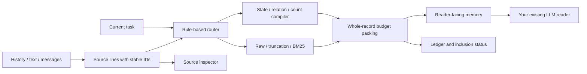

# Architecture

TOMC sits between stored history and an LLM reader. It compiles supported operations, combines the records with selected source text, and returns ordinary text under a memory budget. Your application calls the reader with that text.

## Repository layout

| Directory | Role |
|---|---|
| `src/tomc` | Public API, schemas, token counting, strategies and optional adapters |
| `src/tomc/_vendor` | Preserved research kernels with recorded source hashes |
| `demo` | Gradio interface; root `app.py` starts the Space |
| `benchmarks` | Frozen aggregate evidence and offline verification |
| `src/tomc/data` | Bundled synthetic examples, available after package installation |

Built-in strategies share source normalization and token accounting. The default TOMC strategy calls the preserved state, relation and count kernels. Automatic routing uses compiled records with source text or lexical source retrieval.

The source inspector and candidate ledger are audit views. They can show information omitted from the memory budget. A visible row therefore does not mean the reader received it; check its `included` flag.

## Reader and storage connections

The compiler does not create or call a provider client. `prepare_context` returns a prompt and provider-neutral messages for your own SDK. The optional `APIReader` makes explicit calls to a chat-completions-compatible endpoint. The web UI has no API-key field or paid inference button.

The compiler is stateless. Optional local MCP tools add a SQLite notebook store for explicit save and recall operations. This store is a demo integration; the paper's contribution is the memory representation before an unchanged reader. See [paper scope](paper_scope.md) and [assistant setup](assistant_setup.md).
